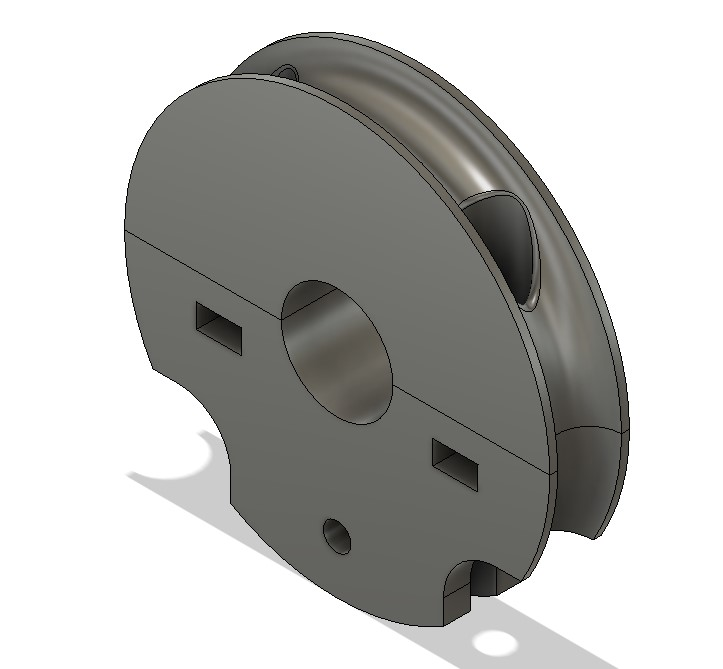

# versatile-door-knob-clamp-for-DN
Footknobを丸物ハンドルに対応させてみた/ Adjustable door clamp for cylinder shape

These are hints of this modification /参考プロジェクトはこちら

https://github.com/DigitalNatureGroup/FootKnob

https://www.stepnpull.com/shop

Main concept
1. After Covid-19 we can remove this without scars on a door.

コロナの後は傷無く取り外せること

2. Make it durable, because our foot operation is too rough.

足で操作できるくらい丈夫に作る

3. More adjustable to round shapes and door latch

丸っこいドアノブやラッチに対応する

4. Open source unless it's commercial

非商用利用に限りオープンソース

sample operation / Installing Image

Installing steps

1.Check your door knob type / ノブの種類を確認

	A. L handle (available) / L字ハンドル
 
	B. Round knob (Now designing) / 丸型ノブ
 
	C. Tapered (Now designing)　/　円柱型のノブ 

2.Measure dimensions / 寸法測定

	A. L handle (available)
		
		A1. Space gap between door and handle/ ハンドルと扉の隙間を測定

		
		A2. Diameter of handle neck / ハンドルネックの外径 

   
	B. Round knob (Now designing)
	C. Tapered (Now designing)
	
3.Download CAD file for Fusion360 / Fusion360CADファイルのダウンロード

[Download](clamp_circular%20v3.f3d)

4.Modify CAD file in Fusion360

Open file with Fusion360.

Select "MODIFY" from the tool-bar. ツールバーから「修正」を選択

Select "Change Parameters" command from the Modify command list. 「修正」からパラメータの変更を選択

Parameters means as bellow. パラメータの意味は以下の通り

1.thickness

2.outer_radius

3.inner_radius

4.guid_gutter_dia
